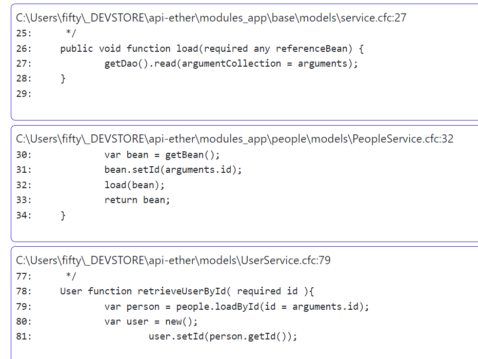
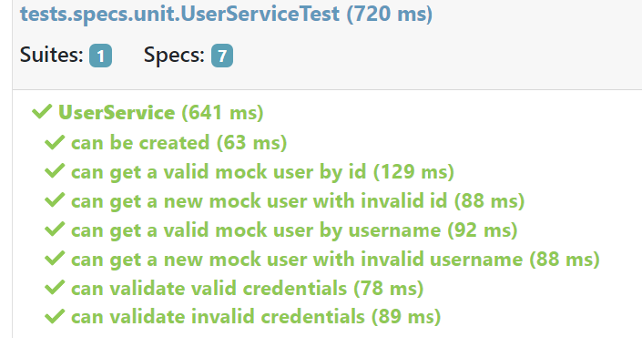

# Ether Developer's Journal - Intro

* [Ether Developer's Journal - Intro](#ether-developers-journal---intro)
	* [Summary](#summary)
		* [Description of Initial Setup](#description-of-initial-setup)
	* [Notes](#notes)
		* [Issues](#issues)
	* [Journal](#journal)
		* [Resources](#resources)
			* [First Run](#first-run)
			* [Testbox](#testbox)
		* [Part 1](#part-1)
		* [Part 2](#part-2)
		* [Part 3](#part-3)
			* [Resources](#resources-1)
			* [Notes](#notes-1)
				* [docker-compose.yml](#docker-composeyml)
				* [dockerfile](#dockerfile)
				* [entrypoint.sh](#entrypointsh)
				* [run-initialization.sh](#run-initializationsh)
				* [initial\_setup.sql](#initial_setupsql)
		* [Part 4](#part-4)
		* [Part 5](#part-5)
			* [cfconfig.json (datasources)](#cfconfigjson-datasources)
			* [db env](#db-env)
			* [main env](#main-env)
			* [update the user with the limited sql account](#update-the-user-with-the-limited-sql-account)

## Summary

I plan on setting up my base app using my coldbox API and MS SQL server and documenting my journey. I wont go into much detail of the app function but document the issues and needs as they arise.

### Description of Initial Setup

* [x] Copy the base API and ensure it runs.
* [x] Ensure everything is up to date.
* [x] Ensure Docker-Compose works and is updated.
* [x] Set SQL server container.
* [x] Add initial DB creation.
* [X] Add SQL server to API compose.
* [x] Test to ensure connects and app works
* [x] Use documentation style and illustrations

## Notes

### Issues

* finding my original SQL server container
* ensuring lucee version has latest updates for docker
  * [forgeBox Lucee Versions](https://www.forgebox.io/view/lucee?filter=stable#versions)
  * [CommandBox server Versioning](https://commandbox.ortusbooks.com/embedded-server/server-versions)
* Finding a good docker compose for MS SQL

## Journal

### Resources
#### First Run


#### Testbox

tests.specs.unit.UserServiceTest

"Message": "No matching function member [true] for call with named arguments found, available function members are [append,clear,copy,count,delete,duplicate,each,every,filter,find,findKey,findValue,insert,isEmpty,keyArray,keyExists,keyList,keyTranslate,len,map,reduce,some,sort,update,valueArray]"

`coldbox\system\ioc\Builder.cfc:170` -> `this.$wbLazyProperties[ arguments.propertyName ].builder`

 

``` cfml
modules_app\base\models\service.cfc:27

26:	public void function load(required any referenceBean) {
27:		getDao().read(argumentCollection = arguments);
28: 	}
```

``` cfml
function buildDao(){
	return new People.models.PeopleDao();
}
```
`property name="dao" type="People.models.PeopleDao" getter="false";`

``` cfml
private People.models.PeopleDao function getDao(){
	if (!variables.keyExists('dao')) {
		setDao(new People.models.PeopleDao());
	}
	return variables.dao;
}
```




1. [webmasterdevlin/docker-compose.yml](https://gist.github.com/webmasterdevlin/24cb85d77c9efb5a302fe9cfdff44844)
	* This isn't bad but not ideal. We will deal with my concerns later.
2. [dbafromthecold/SqlServerDockerCompose](https://github.com/dbafromthecold/SqlServerDockerCompose/blob/master/docker-compose.yaml)
	* Interesting, I like the minimal nature of the compose file & some cool features.
3. [jjuanrivvera99/mssql-docker-compose.yml](https://gist.github.com/jjuanrivvera99/e4357795b5f9ba239533fbd849bd008e)
	* Similar to the first one.
4. [microsoft/mssql-docker](https://github.com/microsoft/mssql-docker/blob/master/linux/mssql-server-linux/Dockerfile)
	* This is a docker file version. Hoping not to go this route.
5. [Configure and customize SQL Server](https://learn.microsoft.com/en-us/sql/linux/sql-server-linux-docker-container-configure?view=sql-server-ver16&pivots=cs1-bash)
	* Microsofts comprehensive custom MS SQL container documentation, for good measure

### Part 1

Step 1. Copy the repository and get it running. 

So far I have copied my base API and got it up and running. Most of my issues are remembering all of the pieces I need. I misplaced my docker-compose SQL files (:sadFace). I have been researching the current best way to set up this docker image. I think I just pulled the image last time and set it up manually. I did setup a development docker image perviously with CF and MS SQL... But I lost it (:cryingface).

I am also making sure I can easily update this app as I go. Commandbox to the rescue, I hope.

### Part 2

I found a few resources for MS SQl docker compose files.

* [webmasterdevlin/docker-compose.yml](https://gist.github.com/webmasterdevlin/24cb85d77c9efb5a302fe9cfdff44844)
* [dbafromthecold/SqlServerDockerCompose](https://github.com/dbafromthecold/SqlServerDockerCompose/blob/master/docker-compose.yaml)
* [jjuanrivvera99/mssql-docker-compose.yml](https://gist.github.com/jjuanrivvera99/e4357795b5f9ba239533fbd849bd008e)
* [microsoft/mssql-docker](https://github.com/microsoft/mssql-docker/blob/master/linux/mssql-server-linux/Dockerfile)
* [Configure and customize SQL Server](https://learn.microsoft.com/en-us/sql/linux/sql-server-linux-docker-container-configure?view=sql-server-ver16&pivots=cs1-bash)

I am setting up the sql server independently first to see if I can get all of the features working before integrating it into a docker compose stack.

``` yml
services:
    mssql:
      container_name: MS_SQL_Server
      image: mcr.microsoft.com/mssql/server:2019-latest
      ports:  
        - "1433:1433"
      build: .
      env_file:
        - .env
      volumes: 
        - sqldata:/var/opt/mssql/data
        - sqllog:/var/opt/mssql/log
        - sqlbackup:/var/opt/sqlserver/backup
volumes:
  sqldata:
  sqllog:
  sqlbackup:
```

So the issue I ran in to initially was that this ms sql server runs without root access by default. This means that creating folders in the compose file throws an error, I get this fun error...

> SQL Server 2019 will run as non-root by default.
> Permission denied

This happens because I am mapping folders for the sql server DB, logs, and... files to a docker volume

my solution is usually strip everything down to it's simplest form until it runs. So this is where I stand.

``` yml
version: '3.7'

services:
    mssql:
      container_name: MS_SQL_Server
      image: mcr.microsoft.com/mssql/server:2019-latest
      ports:  
        - "1433:1433"
      env_file:
        - .env
```

That runs and gives me a server that I can login to.

1. First I need to figure out how to enable permission for folder creation. So far the examples seem to rely on a custom docker file... Lets see if we can avoid this. (I like simplicity)
2. I want to auto load my base sql (db creation and base tables)

* [permission issue](https://github.com/microsoft/mssql-docker/issues/615)

So... it looks like we can give it root permissions directly.

``` yml
services:
    mssql:
      container_name: MS_SQL_Server
      image: mcr.microsoft.com/mssql/server:2019-latest
      user: root
      ports:  
        - "1433:1433"
      env_file:
        - .env
      volumes: 
        - sqldata:/var/opt/sqlserver/data
        - sqllog:/var/opt/sqlserver/log
        - sqlbackup:/var/opt/sqlserver/backup
volumes:
  sqldata:
  sqllog:
  sqlbackup:
```

I decided to use docker volumes.

Yeah, that did it... of corse it did. So I wanted to see if I can get this working without root permissions. I removed root and reset permissions on the folder locally.

``` yml
services:
    mssql:
      container_name: MS_SQL_Server
      image: mcr.microsoft.com/mssql/server:2019-latest
      ports:  
        - "1433:1433"
      env_file:
        - .env
      volumes: 
        - ./sqldata:/var/opt/sqlserver/data
```

Yeah, That works too. Great... So I put it back to docker volumes and ran without root... That worked too... (it shouldn't) this is where I had the error initially. (:sadface)

Well, I'm guessing that since I have the docker volumes created now, we don't have the permissions issues... Lets check. I deleted them.

That still works. I have no idea what has happened. Please feel free to chime in. Maybe I will get rid of all volumes and try again.

Ok mental note, try to make it an env variable...

By the way, I also set the environment variables to switch the backup folder.

```properties
ACCEPT_EULA=Y
MSSQL_BACKUP_DIR=/var/opt/sqlserver/backup
```

Moving on, Lets try to add the database and tables...

### Part 3

#### Resources

* [docker compose init a SQL Server database](https://stackoverflow.com/questions/69941444/how-to-have-docker-compose-init-a-sql-server-database)

* [ ] setup docker file
* [ ] issue pointing to .sql creation file

#### Notes
With a bit of research, I found that MS SQL Server Images do not include an entry point like other db containers. But we may be able to fake it. I found a solution that setup a second SQL Server that waited on a healthcheck for the first SQL Server then used SQL tools to run the init scripts. That seems like overkill.

Solution 2 was to use a docker compose and a bash command to run some scripts. Other than some issues formatting the paths, this was pretty straight forward. I did remove a bunch of stuff I didn't need and grabbed the sql password from the environment variables. `${MSSQL_SA_PASSWORD}`

Here is what I have so far:

##### docker-compose.yml

The compose file sets up the basics.

``` yml
services:
    mssql:
      container_name: MS_SQL_Server
      image: mcr.microsoft.com/mssql/server:2019-latest
      user: root
      ports:  
        - "1433:1433"
      build: .
      env_file:
        - .env
      volumes: 
        - sqldata:/var/opt/mssql/data
        - sqllog:/var/opt/mssql/log
        - sqlbackup:/var/opt/sqlserver/backup
volumes:
  sqldata:
  sqllog:
  sqlbackup:
```

##### dockerfile

The docker file uses the basic image and copies a local directory that contains a bash script.

``` dockerfile
# Choose ubuntu version
FROM mcr.microsoft.com/mssql/server:2019-latest

# Create app directory
WORKDIR /usr/src/app

# Copy initialization scripts
COPY . /usr/src/app

# Run Microsoft SQL Server and initialization script (at the same time)
CMD /bin/bash ./entrypoint.sh
```

##### entrypoint.sh

This bash script will run our init script with the built in setup.

``` shell script
# Run Microsoft SQl Server and initialization script (at the same time)
/usr/src/app/run-initialization.sh & /opt/mssql/bin/sqlservr
```

##### run-initialization.sh

Our db initialization script calls our sql file.

``` shell script
# Wait to be sure that SQL Server came up
sleep 90s

# Run the setup script to create the DB and the schema in the DB
# Note: make sure that your password matches what is in the Dockerfile
/opt/mssql-tools/bin/sqlcmd -S localhost -U sa -P ${MSSQL_SA_PASSWORD} -d master -i InitialCreation/ether_initial_setup.sql
```

##### initial_setup.sql

*Preview of the apps SQL... We will see more later*

the sql script will setup the db, tables, SPs, views, and accounts for coldfusion that we can use later. 

``` SQL
SET NOCOUNT OFF;
GO

PRINT CONVERT(varchar(1000), @@VERSION);
GO

PRINT '';
PRINT N'***Started - ' + CONVERT(varchar, GETDATE(), 121);
GO

USE master 
GO 

-- =================================================== 
-- Drop the database if it already exists then create
-- =================================================== 

PRINT '';
PRINT N'*** Dropping Database';
GO

DROP DATABASE IF EXISTS Ether 
GO

-- If the database has any other open connections close the network connection.
IF @@ERROR = 3702 
    RAISERROR('!! Ether database cannot be dropped because there are still other open connections', 20, 1) WITH NOWAIT, LOG;
GO

-- Drop Previous user
IF EXISTS (SELECT * FROM sys.database_principals WHERE name = N'CFUser')
    DROP USER CFUser
GO

IF EXISTS (SELECT * FROM sys.server_principals WHERE name = N'CFlogin')
    DROP LOGIN CFlogin
GO

DROP ROLE IF EXISTS db_execproc
GO

CREATE DATABASE Ether
GO

IF DB_ID('Ether') IS NOT NULL
    BEGIN
        PRINT N'*** We journey into the Ether'
    END
ELSE
    BEGIN
        RAISERROR ('!! Ether DB not created', 1, 2);
    END
GO
```

There is much more but is unimportant at this point. And this is for later anyway. (:thumbs up)

This will do (:Smiley face)

* Next We will try to add this to to our API container.

### Part 4

This went well, I mostly just combined the compose files and created a folder for the db files I need.

``` yml
volumes:
  sqldata:
  sqllog:
  sqlbackup:
networks:
  ether-network:

services:
  # ColdBox Site
  ether-cfml-api:
    container_name: ${APPNAME}
    image: ortussolutions/commandbox:lucee5
    build:
      context: .
      dockerfile: Dockerfile
    env_file:
      - .env
      - ./db/.env
    depends_on:
      - ether-sql-server
    networks:
      - ether-network
    ports:
      - "8080:8080"
      - "8443:8443"
    # Data & Overrides
    volumes:
      - ./:/app
  ether-sql-server:
    container_name: ether-sql-server
    image: mcr.microsoft.com/mssql/server:2019-latest
    user: root
    build: ./db
    env_file:
      - .env
    networks:
      - ether-network
    ports:
      - "1433:1433"
    volumes: 
      - sqldata:/var/opt/mssql/data
      - sqllog:/var/opt/mssql/log
      - sqlbackup:/var/opt/sqlserver/backup
```

Container seems to run and CF app runs and SQL DB runs and is accessible. Not sure If I can get to ms sql from the api yet. will try that next.

### Part 5

Connect to the docker db in the lucee server. We will use cf config to connect to the db in the commandbox container.

I did not save my cfConfig details for the last time I did a ms sql server connection

So my hack way to get the correct config is to log in to the lucee server admin and set the data source. Then log into the docker desktop terminal for the cf container. Enter `box` and enter. this will start commandBox which has the cfconfig module by default. `cfconfig export <target config name (cfConfigExport.json) in my case>`.

I can now open the file locally (we have setup our container to mirror the local app folder) and look at the datasource section and add it to my cfConfig file.

Now we need to substitute in the env variables.

#### cfconfig.json (datasources)

``` json
"datasources":{
	"EtherDb":{
		"allowAlter":true,
		"allowCreate":true,
		"allowDelete":true,
		"allowDrop":true,
		"allowGrant":true,
		"allowInsert":true,
		"allowRevoke":true,
		"allowSelect":true,
		"allowUpdate":true,
		"blob":"false",
		"class":"com.microsoft.sqlserver.jdbc.SQLServerDriver",
		"clob":"false",
		"connectionLimit":"-1",
		"connectionTimeout":"20",
		"host":"${CF_DB_HOST}",
		"port":"${CF_DB_PORT}",
		"custom":"DATABASENAME=${MSSQL_DATABASE}&trustServerCertificate=true&SelectMethod=direct",
		"database":"${MSSQL_DATABASE}",
		"dbdriver":"MSSQL",
		"dsn":"jdbc:sqlserver://{host}:{port}",
		"liveTimeout":"15",
		"metaCacheTimeout":"60000",
		"username":"${MSSQL_USER}",
		"password":"${MSSQL_SA_PASSWORD}",
		"storage":"false",
		"validate":"true"
	} 
}
```


We can use the container name as the host.

#### db env

``` Properties
# Database Ether
# MS SQL
ACCEPT_EULA=Y
MSSQL_BACKUP_DIR=/var/opt/sqlserver/backup
MSSQL_SA_PASSWORD=MY_sa_PASSW0RD
MSSQL_USER=sa
MSSQL_DATABASE=Ether
CF_DB_HOST=ether-sql-server
CF_DB_PORT=1433
```

#### main env

``` Properties
ENVIRONMENT=development
APPNAME=ether-api
CFCONFIG_ADMINPASSWORD=aNewPass00rd!
TZ=America/Los_Angeles
BOX_SERVER_APP_CFENGINE=lucee@5.4.2+17
DB_USER=CFlogin
DB_PASSWORD=$changem3
```

#### update the user with the limited sql account

``` json
"username":"${DB_USER}",
"password":"${DB_PASSWORD}",
```

Ok, I can check the lucee admin and see we can connect.


So now we need to use the user setup in the sql file.
